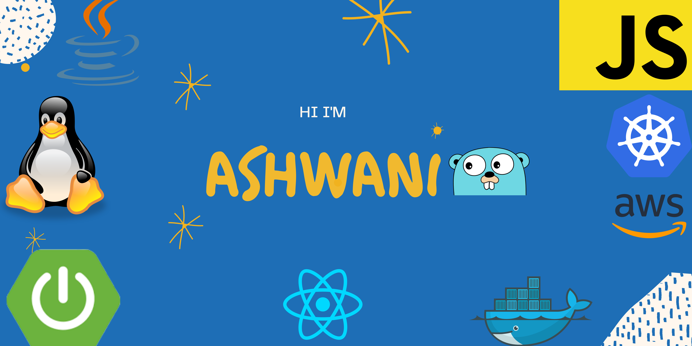

### Hey there 👋

 

## 📝 Latest Blog Posts

 

- [Functional Programming in JS](https://link.medium.com/p43przYDQib)
- [EC2: The Heart of AWS](https://medium.com/swlh/ec2-the-heart-of-aws-7452889f20f2?sk=74c1f5e15f81e5d4d9b04914ce15ecc8)
- [Prototyping Javascript](https://medium.com/swlh/prototyping-javascript-e6ffbd6721a7?sk=2160482c5d939833970ccc01505ea3a8)
- [Github Actions: Power of CICD](https://ashwanipandey1218.medium.com/github-actions-power-of-cicd-27385a1e996)
- [Docker in a nutshell](https://ashwanipandey1218.medium.com/docker-in-a-nutshell-34b983cc3baa)
- [Spring JPA: Under the covers](https://ashwanipandey1218.medium.com/spring-jpa-under-the-covers-ff013ebe7261)

 

## 📌 Pinned Repositories

 

 

## &#x1f4c8; GitHub Stats

 

## 💼 Skills

 

 

 

 
